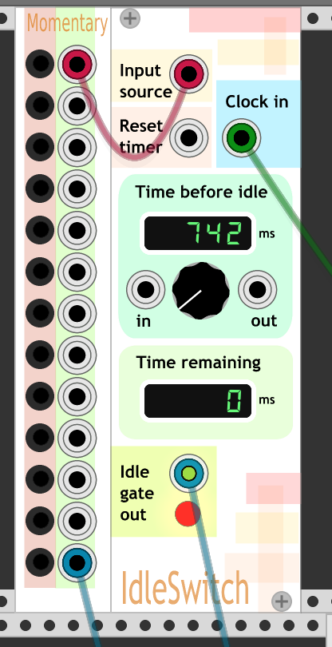

# VCV Rack plugin

Plugins for use with VCV Rack virtual module synthesizer (https://github.com/VCVRack/Rack)

## Modules

### IdleSwitch

#### What

An 'idle loop' inspired module for detecting when an input
is idle and turns on a gate until it sees activity again.

If no input events are seen at "Input Source" within the timeout period
emit a gate on "Idle Gate Output" that lasts until there are input events
again. Then reset the timeout period.

Sort of metaphoricaly like an idle handler or timeout in event based
programming like GUI main loops.

The timeout period is set by the value
of the 'Time before idle' param.

##### Input event

An "Input event" is a gate or trigger (or a CV or audio signal
that looks sufficently like a gate or trigger).

After a input event, the Idle Gate Output will remain on until
an input event is seen at Input Source. When there is an input event, the Idle
Gate Output is turned off until the expiration of the 'Time before idle' or
the next 'Reset idle'.

##### Reset timer

If there is a 'Reset timer' source, when it gets an event, the timeout period
is reset. But unlike an "Input event", a 'Reset timer' event does does not
reset the idle status.

After "Reset time" event, the "Idle Gate Output" will remain on until
an input event is seen at Input Source. When there is an input event, the Idle
Gate Output is turned off until the expiration of the 'Time before idle' or
the next 'Reset idle'.

To use the eventloop/gui main loop analogy, a 'Reset idle' event is equilivent to
running an idle handler directly (or running a mainloop iteration with no non-idle
events pending).

##### Clock input

If a cable is hooked to the "Clock Input" then the pulse from the clock
will determine with the idle time expires. When there is a clock pulse,
if there were no input events since the previous clock pulse that is
considered idle.

The "Time before idle" display will reflect the time since the last
clock pulse. The "Time remaining" display will always show 0 for now,
at least until it can predict the future.

##### Time input and output

The "Time input" expects a CV output between 0 and 10V. The voltage
maps directly do the number of seconds for the idle timeout.
Eg. a 5.0V CV to "Time input" sets "Time before idle" to 5000ms (5.0 seconds)

The "Time output" sends a CV output between 0 and 10V indicating
the "Time before idle" value.

The "Time output" can be used to connect one or more IdleSwitch modules
together so they share the same "Time before idle".

In "Clock input" mode, the "Time Output" will correspond with the
"Time before idle" display until the time is over 10s, then the
"Time output" will max out at 10V.

#### Why

Original intentional was to use in combo with a human player and midi/cv keyboard.
As long as the human is playing, the IdleSwitch output is 'off', but if they go
idle for some time period the output is turned on. For example, a patch may plain
loud drone when idle, but would turn the drone off or down when the human played
and then turn it back on when it stopped. Or maybe it could be used to start an
drum fill...

The 'Reset idle' input allows this be kind of synced to a clock, beat, or sequence.
In the dronevexample above, the drone would then only come back in on a beat.

And perhaps most importantly, it can be used to do almost random output and
make weird noises.

### MomentaryOnButtons

A set of GUI buttons that send a +10V output while pressed.

## License

BSD 3-clause. See LICENSE.txt
