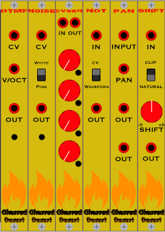

# Charred Desert

Interesting modules for [VCVRack](https://github.com/vcvrack/rack).

The name is an homage to [FrozenWasteland](https://github.com/almosteric/FrozenWasteland),
@almosteric's esoteric module set.

This is a growing work in progress, with only a couple of utility modules currently.
More modules will be added, so if you are interested in following along, either
star the repo, or keep checking back.

## Current Modules



* DTMF - plays DTMF tones as notes
* Noise - plays white or pink noise
* CVSeq - sends selectable CV values ("voltages") in order
* Not - switchable to invert either waveforms (-5 to 5) or CV (0 to 10)
* Pan - sends waveforms from the input to two outputs, panning between

For more information, see the [documentation](docs/README.md).

Want to help fund more development?  [Donate now](https://paypal.me/JerrySievert)!

## Building

```
$ git clone https://github.com/JerrySievert/CharredDesert.git
$ cd CharredDesert
$ git submodule update --init
$ make
```
