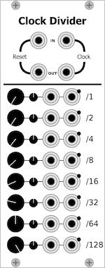
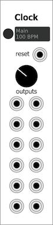
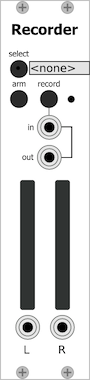
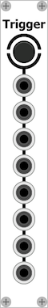

# [VCVRack-Simple](https://iohannrabeson.github.io/VCVRack-Simple/) [](https://travis-ci.org/IohannRabeson/VCVRack-Simple)
Modules for [VCVRack](https://github.com/VCVRack/Rack).  

<p align="center">
<a href="https://iohannrabeson.github.io/VCVRack-Simple/modules/clock_divider"></a>
  <a href="https://iohannrabeson.github.io/VCVRack-Simple/modules/clock"></a>
<a href="https://iohannrabeson.github.io/VCVRack-Simple/modules/recorder"></a>
<a href="https://iohannrabeson.github.io/VCVRack-Simple/modules/button_trigger"></a>
</p>

More infos and user manuals:
https://iohannrabeson.github.io/VCVRack-Simple/

## Building from sources

Clone this repository into the Rack's plugins directory then build using Make:

``` bash
cd Rack/plugins/
git clone https://github.com/IohannRabeson/VCVRack-Simple.git
cd VCVRack-Simple
make
```

### Linux
Compilation is tested on Linux with gcc-7.

### Osx
Compilation is tested on Osx with clang.

### Windows
Compilation is tested with the recommended setup for Rack, using MSys2.

## Website
The website use Jekyll.
You can start a local server using:
``` bash
make serve 
```
