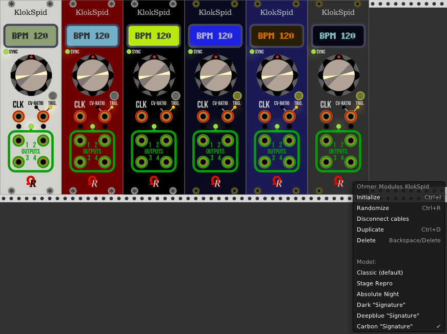
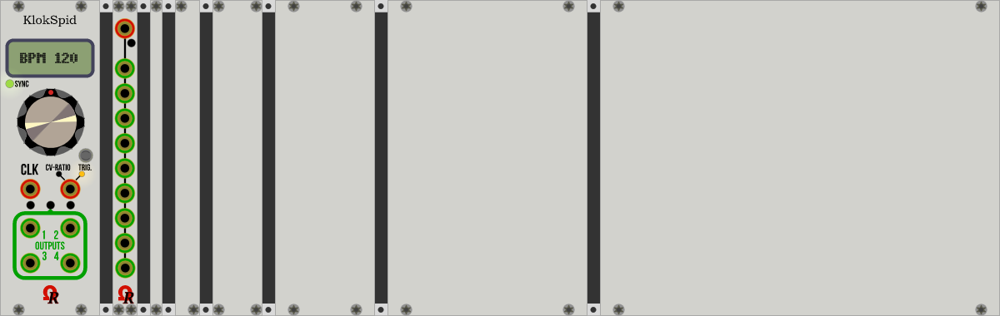

# Ohmer Modules for VCV Rack

Ohmer Modules is a collection of modules designed for [VCV Rack](https://vcvrack.com/).

Flagship is **KlokSpid** module (introduced since v0.5.2, for VCV Rack v0.5.1), as my current development.

KlokSpid (pronunciation of "clock speed") is a modern "CPU-controlled"-style clocking module, designed for any rack requiring BPM-based clock sources and/or clock modulators.

The module is available as six models, can be changed anytime you want, from context-menu (right-click).

**Classic** - default (beige), **Stage Repro** and **Absolute Night** models embed a LCD dot-matrix display (DMD) and silver parts (button and screws). The Absolute Night model embeds a yellow-backlit LCD DMD.

**Dark "Signature"**, **Deepblue "Signature"** and **Carbon "Signature"** models embed a plasma-gas DMD, plus luxury golden screws and button, instead ;)

All Ohmer Modules having connectors (KlokSpid, Splitter 1x9) embed mandatory **golden connectors**, due to expected *high-level quality standards* concerning all of our modules, any range!

Basically, any KlokSpid module provides two modes:

- **Standalone BPM-clock generator**, covering all possible BPM from 10 to 240 (beats), selectable by knob only (no CV). The small button (at the right side of module) may be used to start or stop BPM clocking (current state is reflected by "SYNC" LED: green while running, red while stopped).
- **Clock multiplier/divider** (also known as *clock modulator*) covers predefined ratios, from 1 to 10 (all), 16, 32 and 64, when the ratio is set manually, via module's knob. However, ratio is also voltage-controllable (thanks to CV-RATIO/TRIG. input port) to reach any multiplier or divider value you'd like, including "exotic" ratios (like x37 or /59), from 1 to 64.

Clocking mode is automatically selected by an internal sensor (and module's software), in fact, depending the **CLK** input port is patched to an external source, or not.

If patched, KlokSpid module works as *clock modulator* (source frequency multiplier or divider). Otherwise, it works as standalone (BPM-based) *clock generator*.

Generated pulses are always sent to **four identical** outputs (like a "1x4" multi), to avoid splitter usage (or multiples patch cables connected on same output port).

Voltages sent to all outputs is, by default, defined to **+5V**, but, if required, may changed to **+2V**,  **+10V**, or **+12V** (in this case, real voltage will be +11.7V instead, due to protection diodes behind power supplies).

Output signal duration is, by default set to **Gate 1/4** (25%) of BPM pulse, if working as standalone BPM-clock generator, or current multiplied/divided frequency, as soon as the source frequency is established by the module (otherwise, replied to "fixed 1ms" may be used while source clock isn't stable - aka during "SYNC" operation, indicated by small SYNC LED, when red). This factory setting covers major usages about a clocking device, but of course, many other duration settings can be selected, depending your needs! (e.g.: to control longer sustains for an ADSR envelope generator).

The right-side input port labeled both **CV-RATIO** and **TRIG.** is a versatile port: when KlokSpid module is working as clock multiplier/divider, this port can accept CV to control clocking ratio (any integer value from /64 to x64), via **-5V/+5V bipolar** voltage (default), or optional 0V/+10V unipolar. At the other side, when KlokSpid module is working as standalone BPM-clock generator, this port becomes a "trigger input", and provides, in this case, one of these features:

- as BPM-reset (most common usage) to keep separate KlokSpid modules, as clock generators, perfectly synchronized (default). Obviously, all related BPM-clock generators must have exactly same BPM.
- to toggle BPM "start/stop" states, exactly like a "remote" does (optional, can be set via SETUP).

<u>**TIP:**</u> two small orange LEDs belong this port reflect, when lit, the current port role: CV-RATIO, or TRIG.

Please note both **CLK** and **TRIG.** input ports will trigger at +1.7V (or above), rising edge. Low voltage for "retrigger" is +0.2V (or below), falling edge.

One of interesting feature offered by KlokSpid module is an embedded SETUP program (like personal computer does), in order to customize some settings. To enter the module into its SETUP mode, simply **press and hold** the small button for approx. 2 seconds, until the message **- SETUP -** is displayed, confirming the module's SETUP now is running. Press the button to advance to first setting: CV Polarity.

Setting's name and its current related value is displayed alternately (every 2 seconds).

During SETUP operation, you'll can notice the module continues to work, except you can't alter, via knob, the current ratio (or BPM), because the knob becomes... the value selector (to select another value, for current displayed setting, simply turn the knob clockwise or counter-clockwise). Any setting you're currently editing is reflected, in real-time, this may be useful, for example, to experiment different output durations, voltages, or CV polarity behaviors.

To advance to next setting, just press the button.

Note: as long as you don't touch the knob, the current value (for related parameter) remains unaffected.

The last setting is SETUP-exit "decision" (you'll can use knob to change, then press button):

- **Save/Exit**: all changes made during SETUP operation are saved (this option is always default).
- **Cancel/Exit**: settings prior entered SETUP are fully restored (meaning changes made are ignored).
- **Review**: return to first setting (CV Polarity) and browse all settings again!
- **Factory**: restore initial settings (same as fresh added module in rack), aka "reset to factory".

**<u>TIP:</u>** while module's SETUP is running, **long press/hold** on button does an "immediate Save/Exit", it's a kind of "shortcut", or quick way to quit SETUP, as soon as you consider the current settings are fine, also useful to avoid browsing all other settings until SETUP-exit decision!

Obviously, all settings you've defined via module's SETUP are automatically saved along your ".vcv" patch file (including "autosave.vcv"). Also, all current settings are transferred "on-the-fly" when you duplicate (clone) the module, even during SETUP operation (in this situation, new clone isn't running SETUP mode, however, because cloning assumes an "automatic Save/Exit" for its clone!

Ohmer Modules version 0.6.0.4-beta **sources** are designed for **VCV Rack v0.6.0dev**.

Other Ohmer modules are:

- **Splitter 1x9**, a classic "multi" 1-in to 9-outs, voltage limited into -11.7V/+11.7V bounds (hard clipping, indicated by a red LED near input port, lit when the incoming signal must be clipped).

- Set of blank panels (without logo) to fill any holes in your rack: 1 HP, 2 HP, 4 HP, 8 HP, 16 HP and 32 HP. Please note the 2 HP blank panel have its own context-menu in order to change screws number and arrangement, anytime you'll want!

  

- 64 HP blank panel and useless OhmerKlampf module, are definitively removed (since v0.5.3).

  ​

## Releases

**Source code only here (060dev branch) provided for VCV Rack v0.6.0dev.** No binaries yet.

All ***Ohmer Modules*** are free, source code is provided.

Source code licensed under **BSD 3-Clause** by Dominique Camus. Some graphic materials can't be used for derivative works without my permission.

**Small donations are welcome** if you appreciate my stuff. Please be sure they will serious motivation for me to develop another modules - by this way, I'll can buy "delivered at home pizzas" while I'm working for you! ;)

Feature requests, suggestions, and bug reports are, of course, welcome on GitHub repository.

### Current release: v0.6.0.4-beta (March 8th, 2018):

- Some fixes / enhancements, all are described in [CHANGELOG.TXT](./doc/CHANGELOG.txt).

### Thanks to:

- **Andrew Belt** (and development team) for his fantastic VCV Rack software!
- **Artur Karlov** about KlokSpid source code merge tip (source maintenance is more easy, BTW).
- **Dale Johnson** (author of Valley's *Topograph* module), for GUI-change on the fly (*framing* method).
- **Michael Struggl** , for similar suggestion (about Audibe Instruments' Tidal, using similar feature).
- All builders for MacOS and Linux platforms (I'm using Windows 7 & 10 only, too busy to set up a Linux platform on VM, and too poor to buy a Macintosh ;)
- Generous contributors for donations, tips for coding, optimizations, enhancements and features ideas!
- Our existing (and growing every day) community around VCV Rack.

### Who am I?

My name is Dominique CAMUS, 54 years old French guy, my job is networks and systems administrator (but actually, unemployed), living [Chartres](https://en.wikipedia.org/wiki/Chartres) (world-famous about its wonderful cathedral) located 100 km southwest of Paris, France. Mine hobbies are mainly C.M. experimentations (as curious guy I am), playing keyboard (only live performance, at home in my living room, using M-Audio CODE61 MIDI controller and Liine Lemur app, on iPad 3), flight simulation (Boeing 737 & 777 airliners), Kerbal Space Program, videogame emulators (nostalgy?), pinball games, homemade developments, friends, swimming pool...

### Enjoy!