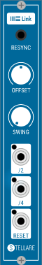

# Stellare Modular Link module for VCV Rack

## Link ##
The link module is a very simple module which provides a 'link' connection with a link enabled application like Ableton Live. It will allow you also to connect two or more VCV rack instances on different computers together which are connected in the same WLAN or LAN. In order to sync perfectly we added a Offset control so you can compensate for any latency introduced in the Link connection.

## Swing ##
In the latest updated we added a swing control knob to the module, the swinged clock signal only works on the /4 output and will have no effect on the /2 output.

## Installation under Windows ##
The Link module will not work out of the box on Windows due to the difference in build systems of VCV Rack and the Link Library. We provide you with a special DLL which needs to be copied manually to the folder where you installed VCV Rack. After extracting the archive, copy the link-wrapper.dll to the installation folder of VCV Rack(eg C:\Program Files\VCV\Rack). Then restart Rack and the Link module will show up under Stellare Modular.

If the module still does not show up after executing the above steps then you probably need to install the [Microsoft Visual C++ Redistributable for Visual Studio 2017](https://go.microsoft.com/fwlink/?LinkId=746572), if it still doesn't work please [create an issue](https://github.com/stellare-modular/vcv-link/issues) on this repository or get in touch via our [facebook page](https://www.facebook.com/stellaremodular).

For Enzo and Sander to have inspirational beer drinking sessions in Berlin to come up with brand new groovy ideas for new Rack modules we would appreciate donations, please use the link below.

[Donate through Paypal](https://paypal.me/stellaremodular)
